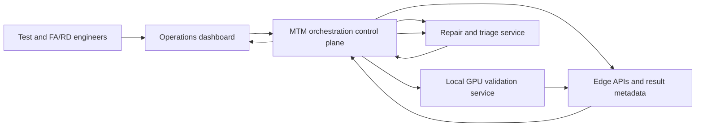

# Oracle GPU Manufacturing Orchestration Platform

> Preserve facts, separate public-safe language from internal details, and use TODOs instead of assumptions.

## Overview

Manufacturing Test Manager (MTM) is a centralized orchestration platform for end-to-end GPU manufacturing validation. It coordinates test initiation, execution monitoring, result collection, failure detection, triage, repair guidance, repair actions, inventory operations, and lifecycle progress across multiple services and vendor environments.

## Business background

The platform gives test-center, failure-analysis, repair, and hardware-development engineers a unified workflow and dashboard for tracking GPU systems from test trigger through diagnosis and remediation.

It supports heterogeneous GPU platforms, including NVIDIA GB200/GB300 and AMD MI355/MI455, across vendor sites in the United States, Taiwan, and Mexico.

TODO: Expand the pre-MTM workflow and quantify the manual fragmentation or delay it replaced.
TODO: Define “VR” in public-safe language before adding it.

## Architecture

MTM runs on service VMs and uses Temporal to coordinate long-running, multi-service workflows.

## Components

- **MTM:** central control plane and workflow owner.
- **Temporal:** durable orchestration and workflow-state persistence.
- **Touchstone:** internal service that runs tests locally on GPU hosts.
- **Edge APIs:** expose test-result metadata and related state.
- **MRT:** manufacturing repair and triage service that returns failure numbers, categories, high-level repair guidance, and repair actions.
- **Dashboard:** operational visibility for test, failure-analysis, repair, and hardware-development engineers.
- **Inventory and rack management:** tracks 15,000+ infrastructure assets and supports rack-level operations.

## End-to-end workflow

1. An engineer initiates a GPU validation workflow through MTM.
2. MTM triggers the local validation service.
3. Temporal monitors long-running execution and coordinates state transitions.
4. MTM retrieves test results and metadata through Edge APIs.
5. When a failure is detected, MTM starts the triage and repair workflow.
6. The triage service returns failure identifiers, categories, repair guidance, and actions.
7. MTM tracks lifecycle progress and exposes it through the dashboard.

## Distributed-systems design

- Deterministic and idempotent workflow execution
- At-least-once execution semantics
- Multi-source state reconciliation
- Recovery during partial service or infrastructure outages
- Separation of asynchronous job execution from artifact availability and downstream validation
- Centralized synchronization workers with batching and adaptive backoff
- Failure attribution across long-running, multi-service workflows

TODO: Document concrete failure scenarios, alternatives considered, and tradeoffs.
TODO: Add public-safe concurrency, throughput, timeout, and API-amplification metrics.

## API and service integration

- Defined service contracts across orchestration, testing, metadata, failure-analysis, repair, inventory, and dashboard systems.
- Drove integration and dependency resolution across software, hardware, validation, and data-center teams.
- Standardized execution across heterogeneous GPU families and international vendor environments.

TODO: Record versioning, compatibility, error-contract, and rollout decisions.

## Leadership and communication

- Led architecture, technical roadmap, and end-to-end delivery.
- Mentored 3–5 engineers across MTM and inventory initiatives.
- Coordinated technical delivery with IGS, Quanta, and other teams across the United States, Taiwan, and Mexico.
- Provided architecture guidance, design reviews, implementation direction, and production-reliability support.

## Impact

- Supported 15,000+ infrastructure assets through inventory and rack-management services.
- Improved frontline operational efficiency by 8x.
- Enabled validation and deployment workflows for large-scale AI and GPU infrastructure.

TODO: Confirm the public-safe noun for the 15,000+ metric.
TODO: Add evidence for throughput, reliability, utilization, deployment time, or incident reduction.

## Public-safe resume bullets

- Led the architecture, technical roadmap, and end-to-end delivery of a centralized orchestration platform coordinating GPU validation, failure triage, repair, inventory operations, and lifecycle management across large-scale AI infrastructure.
- Designed deterministic, idempotent workflows and multi-source state reconciliation, using centralized synchronization, batching, and adaptive backoff to improve resiliency under partial outages and bursty workloads.
- Built and owned inventory and rack-management services supporting **15,000+ infrastructure assets** and improving operational efficiency by **8x**.
- Defined API contracts and drove cross-functional service integration across software, hardware, validation, data-center, and international vendor teams.
- Mentored **3–5 engineers** through architecture guidance, design reviews, implementation, and production readiness.

## Internal-only notes

- Internal names: MTM, Touchstone, Edge API, MRT.
- Do not disclose confidential API paths, failure taxonomies, vendor architecture, rollout capacity, or unpublished GPU counts.
